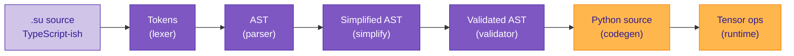

# Compilation: sugar to polynomial

Sutra is a language that looks like TypeScript and executes like linear algebra. The surface syntax — functions, classes, `&&` / `||`, string literals, `if` / `==` — feels familiar to anyone who has written C# or JavaScript. The runtime is tensor arithmetic on a frozen embedding space, with every operation reducing to polynomial evaluation or matrix multiplication.

The compiler is what connects these two worlds. This page walks through the progressive stripping of syntactic sugar — what gets removed at each stage, what the AST looks like by the end, and how a short `.su` program ends up as a handful of element-wise tensor operations.

A useful framing: **every stage of compilation takes something that looks like familiar imperative code and leaves something that looks more like algebra**. By the time the codegen emits Python, there are no `if` statements, no loops, no case analysis — just arithmetic on vectors.

---

## The pipeline



Each arrow is a compiler pass. Each pass removes some surface-level construct and replaces it with a more uniform underlying form.

---

## Stage 1 — Lexer

The lexer takes text and produces tokens. Most of the interesting lexer behavior is standard (keywords, identifiers, operators), but a few Sutra-specific rules show up here:

- **Numeric suffix disambiguation.** `5i` scans as one imaginary-literal token when the character after the `i` is not an identifier continuation; `5 * i` scans as three tokens (literal, operator, identifier). Same rule as Rust / C# numeric suffixes.
- **Character literals.** `'a'` produces a `CHAR_LIT` token with the Unicode code point as its value.
- **`unknown` / `unk` keywords.** Both lex to the same `KW_UNKNOWN` token — no special parser logic, just alias handling in the keyword map.
- **Interpolated strings.** `$"foo {x} bar"` lexes to a sequence of `STRING_INTERP_START`, `STRING_LIT_CHUNK`, `INTERP_OPEN`, inner tokens, `INTERP_CLOSE`, `STRING_INTERP_END` — not a single big string.

Nothing polynomial happens yet. The lexer is text-wrangling only.

---

## Stage 2 — Parser

The parser builds an AST. Each literal form gets its own node (`IntLiteral`, `FloatLiteral`, `ImaginaryLiteral`, `ComplexLiteral`, `CharLiteral`, `StringLiteral`, `BoolLiteral`, `UnknownLiteral`); binary and unary operators become `BinaryOp` and `UnaryOp` nodes; function calls, variable declarations, and class definitions all have their own node types.

At this point the AST still looks like the source. `fuzzy f = 0.7;` is a `VarDecl { type_ref=fuzzy, initializer=FloatLiteral(0.7) }`. The imperative feel is still there.

---

## Stage 3 — Simplify

This is where most of the "surface sugar" disappears. The simplify pass walks the AST and applies a series of rewrites:

### 3.1 Compile-time literal folds

Arithmetic on constant operands reduces to the constant result:

```
5 + 3      →  IntLiteral(8)
5 * 0      →  IntLiteral(0)
x + 0      →  x                        (additive identity)
1 * x      →  x                        (multiplicative identity)
zero_vector() + x  →  x                (zero-vector absorption)
```

### 3.2 Complex-number assembly

Separate literals for real and imaginary parts fold into a single complex literal:

```
5 + 5i     →  ComplexLiteral(re=5, im=5)
5 - 5i     →  ComplexLiteral(re=5, im=-5)
-5i        →  ImaginaryLiteral(-5)      (unary minus fold)
5i + 5i    →  ImaginaryLiteral(10)
5i + 3     →  ComplexLiteral(re=3, im=5)
```

After simplify, `complex c = 5 + 5i;` has no `BinaryOp('+')` in its AST — just a single `ComplexLiteral(5, 5)` waiting to be emitted as one allocation.

### 3.3 Auto-embed in vector-typed contexts

A `StringLiteral` assigned to a variable of type `vector` gets wrapped in `EmbedExpr`, so the codegen knows to emit an LLM-embedding call:

```
vector v = "cat";
```

becomes (conceptually)

```
vector v = embed("cat");
```

The raw string never becomes a runtime string — the compiler has already decided this string is going to be a vector, and rewrites accordingly.

### 3.4 Implicit fuzzy typing

A numeric literal assigned to a `fuzzy`-typed variable folds to a truth-axis allocation:

```
fuzzy f = 0.7;
```

has its initializer rewritten from `FloatLiteral(0.7)` to the conceptual form `make_truth(0.7)` — at codegen time this emits as a single `_VSA.make_truth(0.7)` call, with no intermediate `FloatLiteral` ever reaching the runtime.

### 3.5 Higher-level fusions

Some compositions get recognized as a single substrate operation:

```
bundle(bind(r1, f1), bind(r2, f2), ..., bind(rN, fN))
   →  _VSA.bundle_of_binds((r1, f1), (r2, f2), ..., (rN, fN))
```

One stacked matmul on GPU instead of N separate bind calls followed by a sum. Fuzzy-logic compositions (collapsing XOR / IFF / NAND / NOR to their direct polynomial forms) are the natural next target for this pass, not yet implemented.

---

## Stage 4 — Validator

The validator walks the simplified AST to check things that the grammar alone can't enforce:

- **Primitive-class compatibility.** `fuzzy f = 2.5;` gets an out-of-range warning (SUT0120) because `2.5` is outside `[-1, +1]` on the truth axis.
- **Cast guards.** `(vector) "string"` is flagged — string-to-vector must go through `embed()`, not a cast (SUT0111).
- **Pipe-forward ban.** `x |> f` is rejected (SUT0110) because the spec reserves `|>` for a future use.
- **Modifier conflicts.** `public private f()` is rejected (SUT0112).
- **Naming consistency.** A file using both `Cat` and `cat` as class names gets a casing-drift warning (SUT0113).

No code transformation happens here — the AST goes in and comes out unchanged, possibly with a bag of diagnostics attached.

---

## Stage 5 — Codegen

The codegen walks the validated AST and emits Python source. This is where the remaining sugar — operators, classes, methods — gets translated into the substrate's algebra. Two backends share the translator: `codegen.py` emits numpy-flavored Python (used by the smoke test as the reference path) and `codegen_pytorch.py` emits torch tensor ops, picking CUDA at module init if available.

Key translations:

| Surface form | Emitted form |
|---|---|
| `a && b` | `_VSA.logical_and(a, b)` — polynomial `(a+b+ab−a²−b²+a²b²)/2` at runtime |
| `a \|\| b` | `_VSA.logical_or(a, b)` — polynomial `(a+b−ab+a²+b²−a²b²)/2` |
| `!a` | `_VSA.logical_not(a)` — multiplication by −1 on the truth axis |
| `a == b` | `_VSA.eq(a, b)` — cosine similarity projected onto truth axis |
| `a != b` | `_VSA.neq(a, b)` — logical_not of eq |
| `a * b` (complex) | `_VSA.complex_mul(a, b)` — (r1r2−i1i2, r1i2+i1r2) on the 2D subspace |
| `a * b` (int/float) | `(a * b)` — Python scalar fast path, type-directed |
| `defuzzy(x)` | `_VSA.defuzzify(x)` — truth-axis projection + iterated eq |
| `true` | `_VSA.make_truth(1.0)` |
| `false` | `_VSA.make_truth(-1.0)` |
| `unknown` | `_VSA.make_truth(0.0)` |
| `'a'` | `_VSA.make_char(97)` |
| `5 + 5i` | `_VSA.make_complex(5.0, 5.0)` — single allocation (simplify did the fold) |
| `"cat"` (vector context) | `_VSA.embed('cat')` — batched with other embeds at module init |

The logical / equality / complex-multiplication dispatches are type-directed: the codegen inspects the AST for provable-complex or truth-typed operands and routes through the substrate operation only when appropriate. A plain `int * int` keeps its Python scalar fast path.

---

## Worked examples

Four short programs, showing the full trajectory from source to emitted Python.

### Example 1 — A fuzzy literal

Source:

```c
function fuzzy F() {
    fuzzy f = 0.7;
    return f;
}
```

- **Parser:** `VarDecl { type_ref=fuzzy, initializer=FloatLiteral(0.7) }`.
- **Simplify:** The implicit-fuzzy-typing rule recognizes a fuzzy-typed slot with a literal initializer and folds to the compile-time form `make_truth(0.7)`.
- **Codegen emits:**

  ```python
  def F():
      f = _VSA.make_truth(0.7)
      return f
  ```

One line of substrate code. The surface-level `0.7` never becomes a Python float at runtime; it went straight into the truth-axis allocation.

### Example 2 — Complex-literal folding

Source:

```c
function complex F() {
    complex c = 5 + 5i;
    return c;
}
```

- **Parser:** `VarDecl { initializer=BinaryOp('+', IntLiteral(5), ImaginaryLiteral(5)) }`.
- **Simplify:** The complex-fold rewrite in `_rewrite_binary` recognizes `number + imag` and produces `ComplexLiteral(re=5, im=5)`. The `BinaryOp` and its two child literals are gone.
- **Codegen emits:**

  ```python
  def F():
      c = _VSA.make_complex(5.0, 5.0)
      return c
  ```

Single allocation. No runtime addition. The `+` operator in the source was an authoring convenience.

### Example 3 — String auto-embed

Source:

```c
function vector F() {
    vector v = "cat";
    return v;
}
```

- **Parser:** `VarDecl { type_ref=vector, initializer=StringLiteral("cat") }`.
- **Simplify:** The auto-embed pass rewrites the initializer to `EmbedExpr(StringLiteral("cat"))`, and the string `"cat"` is added to a module-level prefetch list so the batched Ollama call at module init handles all embedded strings in one round-trip.
- **Codegen emits:**

  ```python
  def F():
      v = _VSA.embed('cat')
      return v
  ```

At module init, `_VSA.embed_batch(['cat', ...])` has already populated the codebook, so `_VSA.embed('cat')` is a cache hit.

### Example 4 — XOR composition

Source:

```c
function fuzzy F(fuzzy a, fuzzy b) {
    return (a && !b) || (!a && b);
}
```

- **Parser:** nested `BinaryOp` / `UnaryOp` structure — `OR(AND(a, NOT(b)), AND(NOT(a), b))`.
- **Simplify:** no current rewrite pattern recognizes this composition. The AST stays nested.
- **Codegen emits:**

  ```python
  def F(a, b):
      return _VSA.logical_or(
          (_VSA.logical_and(a, _VSA.logical_not(b))),
          (_VSA.logical_and(_VSA.logical_not(a), b)))
  ```

Five runtime calls. Each evaluates its polynomial:

- `_VSA.logical_not(b)` — degree 1 (`-b`)
- `_VSA.logical_and(a, -b)` — degree 4 polynomial
- `_VSA.logical_not(a)` — degree 1
- `_VSA.logical_and(-a, b)` — degree 4
- `_VSA.logical_or(x, y)` — degree 4

Now here's the interesting part. The **composition of these five polynomials** — the full arithmetic Sutra runs when you call `F(a, b)` — **simplifies symbolically to a single product**:

```
(a && !b) || (!a && b)   ≡   -a · b
```

A future simplifier pass that recognizes the XOR pattern and rewrites to `-a * b` directly would turn the five-call form above into:

```python
def F(a, b):
    return -(a * b)
```

One multiplication. Five kernel launches collapsed to one. This is the polynomial-simplification win the compiler pipeline is structured around — the surface composition can be written in its clearest form, the runtime does the minimal amount of work, because **every intermediate stage speaks polynomials**.

---

## The two ends of the pipeline

A useful summary, in one table, of what the programmer writes and what the machine actually executes:

| programmer writes | machine eventually executes |
|---|---|
| `fuzzy f = 0.7;` | one vector allocation with 0.7 at axis 2 |
| `complex c = 5 + 5i;` | one vector allocation with 5 at axes 0 and 1 |
| `vector v = "cat";` | one dictionary lookup in a pre-filled codebook |
| `a && b` | five arithmetic ops on two scalars (or vectors, componentwise) |
| `a == b` | one matmul (dot product), one sqrt, one division, one allocation |
| `complex_a * complex_b` | four scalar products, two scalar sums, one allocation |
| `defuzzy(x)` | one matmul (projection), 10 cosine-similarity calls |
| `(a && !b) \|\| (!a && b)` | five polynomial calls today; one multiplication after a future simplifier recognizes the XOR pattern |
| `hashmap.get(k)` | one matmul (unbind rotation), one argmax against a codebook |

The surface form is optimized for **human readability**. The runtime form is optimized for **CUDA kernel efficiency**. The compiler is the middle layer that maps between them.

---

## Related reading

- [Logical operations](logical-operations.md) — the polynomial forms of every standard connective and why they're derivable from `{!, &&, ||}`.
- [Numeric math](numeric-math.md) — the same "sugar over polynomials" story for int / float / complex.
- [Memory without control flow](memory.md) — how rotation binding turns array and hashmap operations into single matmuls.
- [Primitive classes](primitive-classes.md) — what each compile-time type tag means in terms of which vector axes carry content.
- [Ontology](ontology.md) — the bigger picture of what this compiler is translating *between*: imperative-looking code on one side, geometric structure in embedding space on the other.
