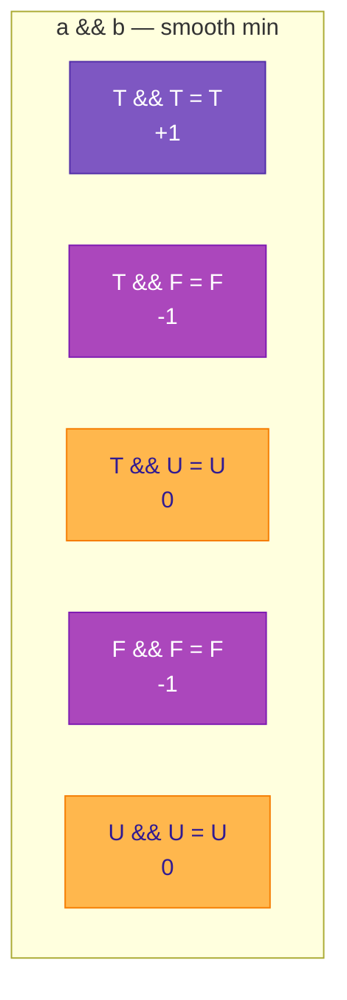
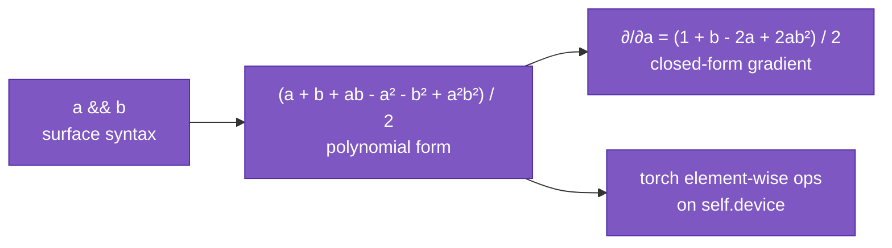
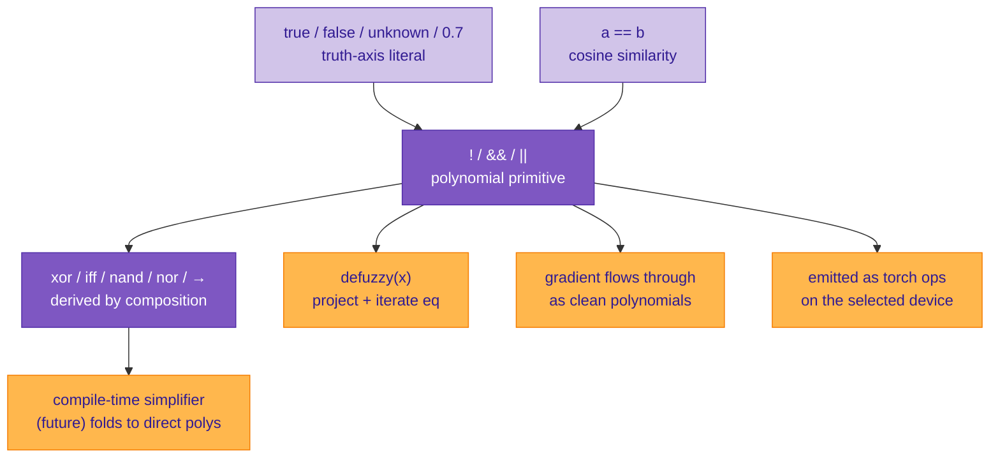

# Logical operations

Most languages treat logic as a crisp, two-valued afterthought: `true` and `false`, wired to control flow, never differentiable. Sutra does the opposite. Logic is **fuzzy-first**, lives on a real-valued axis, and is expressed in pure polynomial arithmetic — so every connective is a smooth function you can differentiate, simplify algebraically, and run on CUDA.

This page explains how that works: the truth axis, the three primitive connectives as polynomials, why polynomials are the right choice, and how every other standard logic gate falls out as a simplification.

---

## The truth axis

All truth-valued types in Sutra live on a single coordinate — `synthetic[AXIS_TRUTH]`, one scalar in `[-1, +1]`. Three primitive classes view this axis through different lenses:

```mermaid
graph TD
    TA[truth axis — synthetic 2]
    TA --> B[bool<br/>values at the poles ±1]
    TA --> F[fuzzy<br/>any value in &#91;-1, +1&#93;]
    TA --> T[trit<br/>{-1, 0, +1} as first-class poles]

    classDef ax fill:#512da8,color:#fff,stroke:#311b92
    classDef leaf fill:#d1c4e9,color:#311b92,stroke:#512da8
    class TA ax
    class B,F,T leaf
```

The runtime representation is identical — a truth-axis scalar — but the compile-time tag controls what the language expects from the value:

| class | range | meaning of `0` | defuzzification |
|---|---|---|---|
| `bool` | `{-1, +1}` at rest | sharpens to nearest pole | binary |
| `fuzzy` | continuous `[-1, +1]` | explicit uncertainty | binary, with `0` as discontinuity |
| `trit` | continuous, `{-1, 0, +1}` attractors | **first-class neutral** | three-way, preserves `0` |

Literals:
- `true` → `+1`
- `false` → `-1`
- `unknown` (or `unk`) → `0`
- Plain numeric literals like `0.7` in a fuzzy-typed slot → `+0.7`

These are all truth-axis *vectors* at runtime — there is no hidden Python-bool path. That fact is what makes differentiable logic possible: every value in a logical expression is a substrate vector, and every operator is vector arithmetic.

---

## Three primitives, polynomial forms

Sutra's logical operators are expressed as smooth polynomials on the truth axis:

```
!a       = -a
a && b   = (a + b + ab − a² − b² + a²b²) / 2
a || b   = (a + b − ab + a² + b² − a²b²) / 2
```

All pure element-wise arithmetic — no `abs`, no branches, no special case at `a = b`. The polynomials were derived by Lagrange interpolation on the three-valued grid `{-1, 0, +1}²`, which guarantees they produce exact `min` / `max` on any grid point while staying `C^∞` everywhere in between.

### Verification on the three-valued grid



The full `3 × 3` AND and OR tables match **Kleene's K₃** (strong three-valued logic) exactly. `true && unknown` is `unknown`. `false && unknown` is `false` (a false premise collapses the conjunction regardless of what the other side is). `unknown || unknown` stays `unknown`.

Kleene's K₃ and Łukasiewicz's Ł₃ agree on AND and OR, but they differ on implication: Łukasiewicz has `U → U = T` (a metaphysical move to preserve identity of propositions about future contingents), while Kleene has `U → U = U` (a computational reading of "U" as "undefined / unknown truth value"). Sutra's derived implication `a → b = !a || b` follows Kleene — our "unknown" is an epistemic gap, not a metaphysical indeterminacy.

### Continuous behavior

For values off the grid, the polynomials are approximations to `min` / `max`, not exact. For example:

```
min(0.7, 0.3) = 0.3                     # true min
a && b  where a = 0.7, b = 0.3  = 0.337  # polynomial
```

The approximation is monotone (ordering preserved), same-sign, and correct at every pole. For three-valued logic — which is what the `bool` / `trit` classes usually do — the approximation is exact. For interpolating continuous fuzzy values, it's a smooth substitute.

---

## Why polynomials

The standard textbook fuzzy-logic formulas use `min` and `max` directly:

```
min(a, b) = (a + b − |a − b|) / 2
max(a, b) = (a + b + |a − b|) / 2
```

These work, but the `|·|` creates a **kink at `a = b`** — the derivative is undefined at the corner, and autograd frameworks paper over it with subgradient dispatch. That's acceptable for training. It's not acceptable for two other things Sutra cares about:

**1. Compile-time simplification.** Polynomial rewriting is trivial — it's just algebra. `abs(x)` is a branch, and recognizing compositions of `abs` requires case analysis. The polynomial form lets the simplifier treat every logical expression as a multivariate polynomial, which is the kind of thing algebraic systems are *built* to manipulate.

**2. Differentiability everywhere.** With the polynomial form, `∂(a && b)/∂a = (1 + b − 2a + 2ab²)/2` — a single closed-form expression with no discontinuity, no subgradient. You can compose operators, differentiate the composition, and get a clean expression out. That matters when the compiler (or a learned pass) wants to analyze or optimize the expression.



On the pytorch backend the emission is literally:

```python
av + bv + av * bv - a2 - b2 + a2 * b2) * 0.5
```

Five element-wise tensor ops, one kernel launch each on CUDA, full autograd support, no `abs` anywhere.

---

## Functional completeness

`{!, &&, ||}` is functionally complete for three-valued logic. Every other connective is a composition — and because everything is a polynomial, compositions **symbolically simplify** into more compact direct polynomials.

### Why this specific primitive set

Classical Boolean logic usually picks a single primitive for completeness:

- **NAND alone** is functionally complete — Henry Sheffer showed this in 1913. Most digital hardware is built on NAND gates because every other gate can be wired out of them. `NOT(a) = NAND(a, a)`, `AND(a, b) = NAND(NAND(a, b), NAND(a, b))`, and so on.
- **NOR alone** is likewise complete — Charles Peirce noted this earlier. Some hardware uses NOR-only logic.

Sutra picks a **three-primitive** set instead — `{!, &&, ||}` — for two reasons:

1. **Each has a simple polynomial form.** NAND and NOR happen to just be the negations of AND and OR polynomials, so we gain nothing polynomial-complexity-wise by making one of them primitive. But `!` alone is degree-1 (`-a`), and AND / OR are symmetric degree-4 polynomials. Three short polynomials instead of one composite one.
2. **Matches programming-language surface syntax.** Every programmer already has `!` / `&&` / `||` from C / Java / JS / Python. No re-training required.

The choice of primitives only affects *how* you build the other connectives — the set of expressible connectives is the same.

### The eight standard connectives, with full polynomial forms

Each row shows the composition in terms of the three primitives **and** the simplified polynomial you get after symbolic expansion. All eight are verified to agree with their intended three-valued truth tables on every point of the `{-1, 0, +1}²` grid.

| connective | surface composition | simplified polynomial | degree |
|---|---|---|---:|
| `!a` | primitive | `-a` | 1 |
| `a && b` | primitive | `(a + b + ab − a² − b² + a²b²) / 2` | 4 |
| `a \|\| b` | primitive | `(a + b − ab + a² + b² − a²b²) / 2` | 4 |
| `a → b` | `!a \|\| b` | `(−a + b + ab + a² + b² − a²b²) / 2` | 4 |
| `nand(a, b)` | `!(a && b)` | `(−a − b − ab + a² + b² − a²b²) / 2` | 4 |
| `nor(a, b)` | `!(a \|\| b)` | `(−a − b + ab − a² − b² + a²b²) / 2` | 4 |
| `xor(a, b)` | `(a && !b) \|\| (!a && b)` | **`−a · b`** | **2** |
| `iff(a, b)` | `(a → b) && (b → a)` | **`a · b`** | **2** |

### The NAND / NOR polynomials are just negations

The simplified NAND / NOR polynomials are hard to read at first because they have six terms with mixed signs. The easier way to see them: NAND is the negation of AND, NOR is the negation of OR, and Sutra's negation is just multiplication by `-1`. So:

```
AND(a, b)  =  (a + b + ab − a² − b² + a²b²) / 2

NAND(a, b) =  !(a && b)
           =  -AND(a, b)
           =  -(a + b + ab − a² − b² + a²b²) / 2
           =  (−a − b − ab + a² + b² − a²b²) / 2
```

Every sign in the AND polynomial flipped. That's the whole derivation — nothing happens term by term, the outer `-` distributes across everything.

The same is true for NOR:

```
OR(a, b)   =  (a + b − ab + a² + b² − a²b²) / 2

NOR(a, b)  =  !(a || b)
           =  -OR(a, b)
           =  (−a − b + ab − a² − b² + a²b²) / 2
```

Again, just sign flips. You don't need to memorize two new polynomials; just remember "NAND = negated AND polynomial, NOR = negated OR polynomial." At the substrate level Sutra can also run NAND as a composition `!(a && b)` — two runtime ops (an AND polynomial plus a sign flip). Same answer, slightly more hops.

### XOR and IFF

```
xor(a, b) = (a && !b) || (!a && b)   =   -a · b
iff(a, b) = (a → b) && (b → a)       =    a · b
```

On a signed truth scale (`-1 = false`, `+1 = true`, `0 = unknown`), the product of signs is `+1` when they agree, `-1` when they disagree, `0` when either is unknown. That's the IFF truth table; negated, it's XOR.

### Example: writing the derived connectives in Sutra

```c
// Shipped in tests/corpus/valid/35_derived_logic.su.
// Each of these is a composition of the three primitives.

function fuzzy Xor(fuzzy a, fuzzy b) {
    return (a && !b) || (!a && b);    // simplifies to -a·b
}

function fuzzy Iff(fuzzy a, fuzzy b) {
    return (!a || b) && (!b || a);     // simplifies to a·b
}

function fuzzy Implies(fuzzy a, fuzzy b) {
    return !a || b;
}

function fuzzy Nand(fuzzy a, fuzzy b) {
    return !(a && b);                  // simplifies to -AND polynomial
}

function fuzzy Nor(fuzzy a, fuzzy b) {
    return !(a || b);                  // simplifies to -OR polynomial
}
```

Each runs as written — the polynomial primitives compose exactly the way the source code says. A future compile-time simplifier pass can recognize the common patterns and rewrite them to their direct polynomial forms, saving runtime ops. That's just algebra on the polynomial expressions; no special-case machinery.

### Worked expansion: NAND from the composition

Just to show the step-by-step:

```
NAND(a, b)  =  !(a && b)
            =  !((a + b + ab − a² − b² + a²b²) / 2)       # expand AND
            =  -(a + b + ab − a² − b² + a²b²) / 2         # ! is multiply by -1
            =  (−a − b − ab + a² + b² − a²b²) / 2         # distribute
```

Three algebraic steps, no case analysis. Compare to classical truth-table derivation where you'd enumerate nine cases and prove each one — the polynomial form lets you do it in three lines.

### Verification

All the polynomial-vs-composition equivalences are verified on the `{-1, 0, +1}²` grid (9 points × 5 connectives × 2 forms = 90 comparisons). See the derivation and verification in [`planning/findings/2026-04-23-logic-gate-polynomial-forms.md`](https://github.com/EmmaLeonhart/Sutra/blob/master/planning/findings/2026-04-23-logic-gate-polynomial-forms.md).

---

## Ordered comparison — number-axis only

Unlike the logical operators, **ordered comparison is not a fuzzy-logic operation**. `>` / `<` / `>=` / `<=` are relations on the real line — they ask "which of these two real numbers is larger," and the natural answer is a crisp direction (true / false / tie). Putting them on the truth axis as a smooth polynomial would produce an answer, but not a *meaningful* one; fuzzy logic genuinely doesn't help here.

So in Sutra, comparison is a **number-axis** operation that produces a **truth-axis** output, built from pure tensor arithmetic with no componentwise predicate:

```
a > b   pipeline:
   1. diff   = a − b                      element-wise vector subtraction
   2. diff_r = _real_projector @ diff     matmul — zero every axis except real
   3. signed = tanh(k · diff_r)           componentwise smooth sign, k ~ 100
   4. result = _truth_from_real @ signed  matmul — place that on the truth axis
```

`tanh` with a steep slope (`k ≈ 100`) saturates to ±1 almost instantly for any non-tie difference — `tanh(100 · 1)` is indistinguishable from `+1` at double precision. The transition region near zero is smooth and differentiable; that's the whole point of using `tanh` rather than a predicate.

### Behavior

| case | `a > b` |
|---|:---:|
| `a` much greater | `+1` |
| `a` much less | `−1` |
| `a` slightly greater (diff ≈ 0.01) | ≈ `+0.76` (smooth region) |
| `a = b` (exact tie) | `0` (unknown — `tanh(0)` = 0) |

`lt(a, b)` is `gt(b, a)` — just sides swapped. On this scheme `>=` and `<=` collapse to `>` and `<`: the tie case gives `tanh(0) = 0` regardless of strict vs. non-strict, so the distinction doesn't carry information. Programs that need to separate "strictly greater" from "tied" compose with `==`:

```c
bool strictly_greater = defuzzy(a > b);
bool equal            = defuzzy(a == b);
// if you need a "≥" that's true on tie, write (a > b) || (a == b).
```

### Differentiable

Every step is a standard tensor op with a known gradient: vector subtraction (linear), matmul (linear), `tanh` (smooth, `∂tanh/∂x = 1 − tanh²(x)`). Autograd can trace through the whole comparison and produce gradients w.r.t. the input values — useful if the comparison is sitting inside a learned pipeline where you want gradient signal through the ordering decision.

### Type rules

Comparison is defined only on number-family operands: `int`, `float`, `complex` (via its real axis), `char`, `scalar`. It is a **compile-time error** to compare truth-family values (`bool`, `fuzzy`, `trit`) with `>` / `<` / `>=` / `<=`:

```c
fuzzy a = 0.7;
fuzzy b = 0.3;
return a > b;   // error: ordered comparison is not defined on truth-axis values
```

If a custom class wants comparison semantics, it can override the operators. The base language reserves ordered comparison for the number axis.

### Type rules

Comparison is defined only on number-family operands: `int`, `float`, `complex` (via its real axis), `char`, `scalar`. It is a **compile-time error** to compare truth-family values (`bool`, `fuzzy`, `trit`) with `>` / `<` / `>=` / `<=`:

```c
fuzzy a = 0.7;
fuzzy b = 0.3;
return a > b;   // error: ordered comparison is not defined on truth-axis values
```

If a custom class wants comparison semantics, it can override the operators. The base language reserves ordered comparison for the number axis.

### Why not a polynomial like AND / OR

AND / OR / NOT / equality / defuzzification live on the truth axis — values are in `[-1, +1]`, and polynomial forms give exact results at the three-valued grid while staying smooth. Ordered comparison is different: the inputs are on the *number* axis, which is unbounded, so a fixed-degree polynomial can't be exact over the whole domain. The `tanh` form is what a continuous-sign operation looks like when the inputs aren't bounded to `[-1, +1]` — it saturates at the ends, smoothly interpolates in the middle, and carries a gradient.

---

## How it fits together



Equality `a == b` on vectors is cosine similarity projected onto the truth axis — a differentiable tensor reduction — producing a fuzzy that flows back into the same polynomial pipeline. `defuzzy(x)` projects onto the truth axis and iterates `x = x == true` to sharpen toward `{true, false, unknown}`. The whole logic layer is one continuous vector/tensor computation from literal to decision.

---

## Summary

- **Logic is fuzzy-first.** `bool`, `fuzzy`, and `trit` are views of one truth-axis coordinate.
- **Three primitive polynomials** (`!`, `&&`, `||`) give you functional completeness on the three-valued grid.
- **No kinks.** Polynomial forms instead of `abs(·)` — smooth gradients, simplifier-friendly, CUDA-native.
- **Derived gates compose, and compositions simplify.** XOR and IFF collapse to single products; NAND / NOR fold negation into the AND / OR polynomial; implication is a rewrite of `!a || b`.
- **The whole pipeline is differentiable.** From literal through composed connective through defuzzification, every step is polynomial or reduction. Gradients flow end-to-end as closed-form expressions.

---

## Related reading

- [Primitive classes](primitive-classes.md) — the broader "everything is a vector" picture.
- [Simplified polynomial forms for every logic gate](https://github.com/EmmaLeonhart/Sutra/blob/master/planning/findings/2026-04-23-logic-gate-polynomial-forms.md) — derivation and 45-point verification.
- [`tests/corpus/valid/32_logical_operators.su`](https://github.com/EmmaLeonhart/Sutra/blob/master/sdk/sutra-compiler/tests/corpus/valid/32_logical_operators.su) — polynomial primitives in Sutra source.
- [`tests/corpus/valid/35_derived_logic.su`](https://github.com/EmmaLeonhart/Sutra/blob/master/sdk/sutra-compiler/tests/corpus/valid/35_derived_logic.su) — XOR / NAND / NOR / IMPLIES / IFF derived in Sutra.
