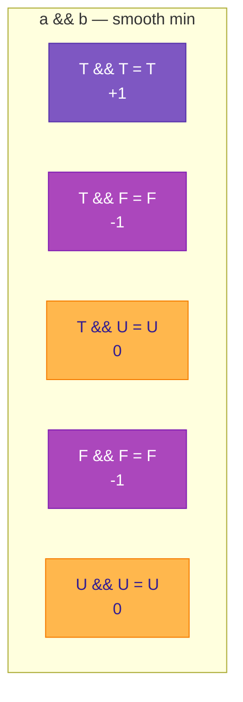
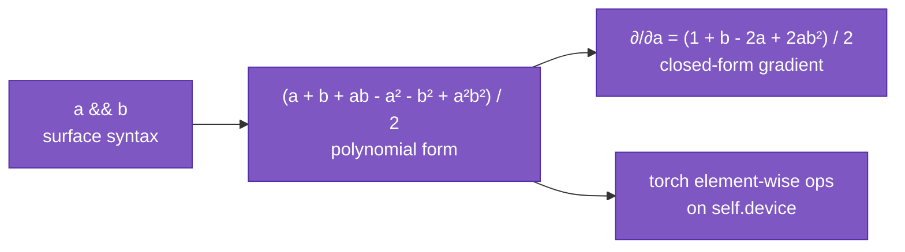
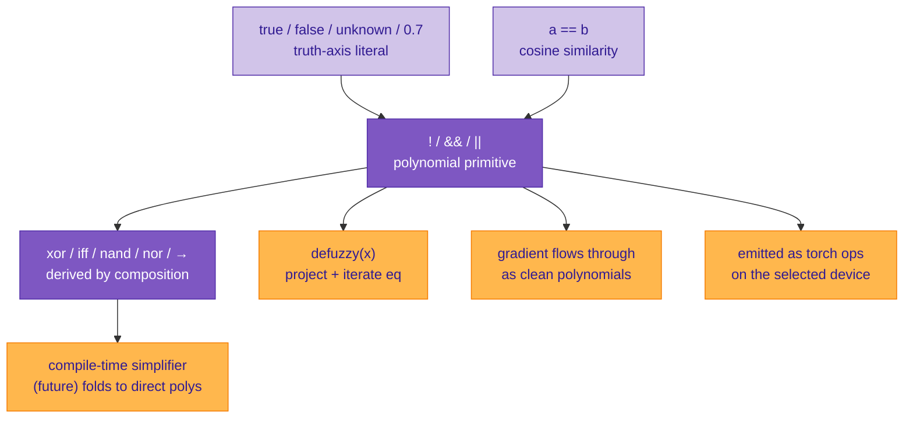

# Logical operations

Most languages treat logic as a crisp, two-valued afterthought: `true` and `false`, wired to control flow, never differentiable. Sutra does the opposite. Logic is **fuzzy-first**, lives on a real-valued axis, and is expressed in pure polynomial arithmetic — so every connective is a smooth function you can differentiate, simplify algebraically, and run on CUDA.

This page explains how that works: the truth axis, the three primitive connectives as polynomials, why polynomials are the right choice, and how every other standard logic gate falls out as a simplification.

---

## The truth axis

All truth-valued types in Sutra live on a single coordinate — `synthetic[AXIS_TRUTH]`, one scalar in `[-1, +1]`. Three primitive classes view this axis through different lenses:

```mermaid
graph TD
    TA[truth axis — synthetic 2]
    TA --> B[bool<br/>values at the poles ±1]
    TA --> F[fuzzy<br/>any value in &#91;-1, +1&#93;]
    TA --> T[trit<br/>{-1, 0, +1} as first-class poles]

    classDef ax fill:#512da8,color:#fff,stroke:#311b92
    classDef leaf fill:#d1c4e9,color:#311b92,stroke:#512da8
    class TA ax
    class B,F,T leaf
```

The runtime representation is identical — a truth-axis scalar — but the compile-time tag controls what the language expects from the value:

| class | range | meaning of `0` | defuzzification |
|---|---|---|---|
| `bool` | `{-1, +1}` at rest | sharpens to nearest pole | binary |
| `fuzzy` | continuous `[-1, +1]` | explicit uncertainty | binary, with `0` as discontinuity |
| `trit` | continuous, `{-1, 0, +1}` attractors | **first-class neutral** | three-way, preserves `0` |

Literals:
- `true` → `+1`
- `false` → `-1`
- `unknown` (or `unk`) → `0`
- Plain numeric literals like `0.7` in a fuzzy-typed slot → `+0.7`

These are all truth-axis *vectors* at runtime — there is no hidden Python-bool path. That fact is what makes differentiable logic possible: every value in a logical expression is a substrate vector, and every operator is vector arithmetic.

---

## Three primitives, polynomial forms

Sutra's logical operators are expressed as smooth polynomials on the truth axis:

```
!a       = -a
a && b   = (a + b + ab − a² − b² + a²b²) / 2
a || b   = (a + b − ab + a² + b² − a²b²) / 2
```

All pure element-wise arithmetic — no `abs`, no branches, no special case at `a = b`. The polynomials were derived by Lagrange interpolation on the three-valued grid `{-1, 0, +1}²`, which guarantees they produce exact `min` / `max` on any grid point while staying `C^∞` everywhere in between.

### Verification on the three-valued grid



The full `3 × 3` AND and OR tables match Łukasiewicz's `Ł₃` three-valued logic exactly. `true && unknown` is `unknown`. `false && unknown` is `false` (a false premise collapses the conjunction). `unknown || unknown` stays `unknown`.

### Continuous behavior

For values off the grid, the polynomials are approximations to `min` / `max`, not exact. For example:

```
min(0.7, 0.3) = 0.3                     # true min
a && b  where a = 0.7, b = 0.3  = 0.337  # polynomial
```

The approximation is monotone (ordering preserved), same-sign, and correct at every pole. For three-valued logic — which is what the `bool` / `trit` classes usually do — the approximation is exact. For interpolating continuous fuzzy values, it's a smooth substitute.

---

## Why polynomials

The standard textbook fuzzy-logic formulas use `min` and `max` directly:

```
min(a, b) = (a + b − |a − b|) / 2
max(a, b) = (a + b + |a − b|) / 2
```

These work, but the `|·|` creates a **kink at `a = b`** — the derivative is undefined at the corner, and autograd frameworks paper over it with subgradient dispatch. That's acceptable for training. It's not acceptable for two other things Sutra cares about:

**1. Compile-time simplification.** Polynomial rewriting is trivial — it's just algebra. `abs(x)` is a branch, and recognizing compositions of `abs` requires case analysis. The polynomial form lets the simplifier treat every logical expression as a multivariate polynomial, which is the kind of thing algebraic systems are *built* to manipulate.

**2. Differentiability everywhere.** With the polynomial form, `∂(a && b)/∂a = (1 + b − 2a + 2ab²)/2` — a single closed-form expression with no discontinuity, no subgradient. You can compose operators, differentiate the composition, and get a clean expression out. That matters when the compiler (or a learned pass) wants to analyze or optimize the expression.



On the pytorch backend the emission is literally:

```python
av + bv + av * bv - a2 - b2 + a2 * b2) * 0.5
```

Five element-wise tensor ops, one kernel launch each on CUDA, full autograd support, no `abs` anywhere.

---

## Functional completeness

`{!, &&, ||}` is functionally complete for three-valued logic. Every other connective is a composition — and because everything is a polynomial, compositions **symbolically simplify** into more compact direct polynomials.

The eight standard connectives, each verified by Lagrange interpolation on the `{-1, 0, +1}²` grid:

| connective | surface form | simplified polynomial | degree |
|---|---|---:|---:|
| `!a` | primitive | `-a` | 1 |
| `a && b` | primitive | `(a + b + ab − a² − b² + a²b²) / 2` | 4 |
| `a \|\| b` | primitive | `(a + b − ab + a² + b² − a²b²) / 2` | 4 |
| `nand` | `!(a && b)` | `−(AND poly)` | 4 |
| `nor` | `!(a \|\| b)` | `−(OR poly)` | 4 |
| `xor` | `(a && !b) \|\| (!a && b)` | **`−a·b`** | **2** |
| `iff` | `(a → b) && (b → a)` | **`a·b`** | **2** |
| `implies` | `!a \|\| b` | `(−a + b + ab + a² + b² − a²b²) / 2` | 4 |

The two standouts — **XOR and IFF both collapse to single products**:

```
xor(a, b) = (a && !b) || (!a && b)   =   -a · b
iff(a, b) = (a → b) && (b → a)       =    a · b
```

That's a five-op nested composition reducing to a single multiplication. On the signed truth scale, "the two values disagree" is exactly the negative product of their signs, and "they agree" is the positive product. The polynomial AND / OR machinery vanishes into the product after simplification.

### Example: writing derived connectives in Sutra

```c
// Shipped in tests/corpus/valid/35_derived_logic.su.
// Each of these is a composition of the three primitives.

function fuzzy Xor(fuzzy a, fuzzy b) {
    return (a && !b) || (!a && b);
}

function fuzzy Iff(fuzzy a, fuzzy b) {
    return (!a || b) && (!b || a);
}

function fuzzy Implies(fuzzy a, fuzzy b) {
    return !a || b;
}
```

Each runs as written. A future compile-time simplifier pass can recognize the patterns and rewrite `Xor`'s body to `-a · b` directly (saving 4 runtime ops).

---

## How it fits together



Equality `a == b` on vectors is cosine similarity projected onto the truth axis — a differentiable tensor reduction — producing a fuzzy that flows back into the same polynomial pipeline. `defuzzy(x)` projects onto the truth axis and iterates `x = x == true` to sharpen toward `{true, false, unknown}`. The whole logic layer is one continuous vector/tensor computation from literal to decision.

---

## Summary

- **Logic is fuzzy-first.** `bool`, `fuzzy`, and `trit` are views of one truth-axis coordinate.
- **Three primitive polynomials** (`!`, `&&`, `||`) give you functional completeness on the three-valued grid.
- **No kinks.** Polynomial forms instead of `abs(·)` — smooth gradients, simplifier-friendly, CUDA-native.
- **Derived gates compose, and compositions simplify.** XOR and IFF collapse to single products; NAND / NOR fold negation into the AND / OR polynomial; implication is a rewrite of `!a || b`.
- **The whole pipeline is differentiable.** From literal through composed connective through defuzzification, every step is polynomial or reduction. Gradients flow end-to-end as closed-form expressions.

---

## Related reading

- [Primitive classes](primitive-classes.md) — the broader "everything is a vector" picture.
- [Simplified polynomial forms for every logic gate](https://github.com/EmmaLeonhart/Sutra/blob/master/planning/findings/2026-04-23-logic-gate-polynomial-forms.md) — derivation and 45-point verification.
- [`tests/corpus/valid/32_logical_operators.su`](https://github.com/EmmaLeonhart/Sutra/blob/master/sdk/sutra-compiler/tests/corpus/valid/32_logical_operators.su) — polynomial primitives in Sutra source.
- [`tests/corpus/valid/35_derived_logic.su`](https://github.com/EmmaLeonhart/Sutra/blob/master/sdk/sutra-compiler/tests/corpus/valid/35_derived_logic.su) — XOR / NAND / NOR / IMPLIES / IFF derived in Sutra.
