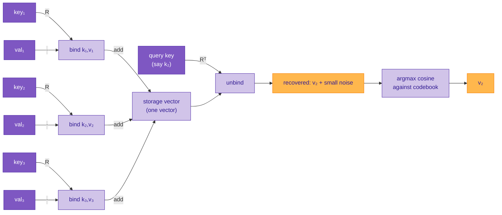

# Memory without control flow

In most programming languages, "store and retrieve" requires control flow. An array read is an index computation followed by a pointer dereference. A hashmap lookup is a hash computation, a bucket dispatch, a conditional chain to handle collisions. These operations read the CPU's program counter — there's a branch somewhere, explicit or implicit, that picks which memory cell to touch.

Sutra does memory differently. Storage and retrieval are **pure algebraic operations** — no branches, no pointers, no index decode. A whole array or hashmap lives as a **single vector** that was built by adding things together, and a lookup is a **single mathematical operation** applied to that vector. This page explains the trick, why it works, and what it costs.

The mechanism is **rotation binding + additive superposition**, a classical construction from Vector Symbolic Architectures (VSA) that Sutra adopts for its array and hashmap types.

---

## The intuition: high-dimensional space is mostly empty

Before the math, the picture that makes this work.

A 868-dimensional vector has, loosely speaking, "a lot of room." Two random unit vectors in 868-dim space have an expected dot product of zero — they're *nearly orthogonal* in the statistical sense. You can pick thousands of random directions and they'll all point approximately different ways, because the space is vast enough to accommodate them without crowding.

A rotation is a function that takes a vector and moves it to a different direction in the same space. Pick a random rotation `R`, and `R · v` is pointing somewhere essentially unrelated to where `v` was pointing. Pick a different random rotation `R'`, and `R' · v` is pointing somewhere essentially unrelated to both.

Now the key idea: **every key in a hashmap gets assigned a different rotation, and storing a value under that key means rotating the value to the direction that the key claims.** Different keys → different rotations → different directions in the huge vector space. The stored values don't overwrite each other because they end up scattered across nearly-orthogonal parts of the space.

Retrieving is the reverse rotation. The retrieved vector has the wanted value pointing where values normally point, and the other stored values pointing in nearly-random directions — which means they contribute almost nothing along the direction you're reading out. The clean signal survives; the other content becomes background noise that scales as `1/√d` in magnitude. At `d = 868`, that's about `0.034` per other entry, which is quiet enough that ~30 entries can coexist in a single vector without the background swamping any one of them.

The entire storage scheme is riding on the fact that **high-dimensional space is so much bigger than the stuff we put in it.** That's not a metaphor — it's the reason the arithmetic works.

---

## The core mechanism

### Binding a key to a value

Every key has a unique rotation matrix `R(key)` associated with it. Binding a value to a key is matrix-vector multiplication:

```
bind(key, value) = R(key) · value
```

`R(key)` is deterministic — the same key always produces the same rotation. The rotation is orthogonal (norms are preserved) and essentially random (a Haar-distributed rotation, or a block-diagonal variant).

The rotation is *invertible* because it's orthogonal — `R(key)ᵀ` takes `R(key) · value` back to `value`. That's the retrieval operation.

### Adding many bindings into one vector

An array or hashmap is just a sum of bindings:

```
storage = bind(k₁, v₁) + bind(k₂, v₂) + bind(k₃, v₃) + …
        = R(k₁)·v₁ + R(k₂)·v₂ + R(k₃)·v₃ + …
```

This is a single vector in the same space as any individual `vᵢ`. It doesn't matter how many pairs you added — the result is always one vector. The storage cost is `O(d)` (the vector's dimension), not `O(n)` where `n` is the number of entries.

### Reading back one entry

To retrieve the value at `kᵢ`, you apply `R(kᵢ)ᵀ` to the whole storage vector:

```
R(kᵢ)ᵀ · storage
  = R(kᵢ)ᵀ · (R(k₁)·v₁ + R(k₂)·v₂ + … + R(kᵢ)·vᵢ + …)
  = R(kᵢ)ᵀ·R(k₁)·v₁ + … + R(kᵢ)ᵀ·R(kᵢ)·vᵢ + …
  = R(kᵢ)ᵀ·R(k₁)·v₁ + … + vᵢ + …
```

The `i`-th term collapses to `vᵢ` because `R(kᵢ)ᵀ · R(kᵢ) = I` (orthogonal inverse). Every other term becomes a product of two independent rotations applied to a vector — which is a new, essentially random vector with magnitude no larger than `|vⱼ|`.

The recovered quantity is therefore `vᵢ + (noise from N-1 other entries)`.

### Noise

The key claim — and the part that makes this work — is that the "noise" is small. Two independently-rotated vectors have an *expected* inner product of zero (the rotations decorrelate them), and the magnitude of the noise component along any given direction scales as `1/√d` where `d` is the vector dimension.

For `d = 868` (Sutra's demo extended-state size), the per-other-entry noise is roughly `0.034 × |vⱼ|` in any given direction. With a few dozen entries stored, the noise builds up to where it's competitive with the signal — but for small `N` (say `N < 32`) the signal dominates by a comfortable margin, and the argmax-cosine lookup returns the right answer.

---

## Storage, retrieval, and lookup — as a single expression



Notice what's missing from this diagram:

- No loop.
- No `if` checking which bucket to use.
- No array index decode.
- No pointer indirection.

Every operation is arithmetic: matrix-vector multiplication, vector addition, and at the end a similarity comparison against a small codebook of candidate values (which is a matmul in the compiler's emitted code). A hashmap of 32 entries is retrieved by *one* matmul and *one* argmax, with no control flow anywhere in the retrieval path.

---

## Arrays: when the keys are integers

An array is a hashmap whose keys happen to be integers. Sutra reuses the exact same rotation-binding mechanism with a deterministic rotation per integer index:

```
array[i]       ↔    bind(key_for(i), array_element_i)
array-as-one   =    sum_i  bind(key_for(i), array_element_i)
read(array, i) =    unbind(key_for(i), array-as-one)
                    then argmax-cosine against codebook
```

The only thing specific to arrays here is that `key_for(i)` is seeded by the integer `i` so consecutive indices produce distinct-but-deterministic rotations. In the compiler's emitted code, the array's "storage" is a single vector that was built by summing bindings, and the "index" is just the input to a hash that picks the rotation.

### What this buys us

- **Arrays and hashmaps share one runtime primitive.** There is no separate storage strategy for "contiguous integer-indexed" vs "key-value-pair" collections.
- **`array[i]` has no bounds check.** There is no index decode that could go out of range; the rotation always produces a vector, and the retrieval always returns *something*. If the index was never stored, the retrieval is noise and the cleanup's argmax returns an arbitrary value — which you'd catch at the cleanup step, not at the index.
- **Parallel reads are free.** Reading five different indices is five independent matmuls with no dependencies; the compiler emits them as a batch on GPU with a single kernel launch.

### What it costs

- **Capacity limit.** Past a certain number of entries (~32 for `d = 868` in the current runtime, measured in [this finding](https://github.com/EmmaLeonhart/Sutra/blob/master/planning/findings/2026-04-23-rotation-hashmap-capacity-extended-state.md)), the accumulated noise overwhelms the signal and lookups start failing. An array bigger than ~32 elements in a 868-d space needs to be split, use a larger dimension, or use a hierarchical structure.
- **Every lookup needs a codebook.** The recovered vector is "signal + noise" — you need the set of candidate answers to cosine-match against, or you can't disambiguate from an arbitrary vector. The compiler handles this by bundling each array's possible values into a codebook at compile time.
- **Writes allocate a new vector.** There's no in-place mutation — `storage.set(key, value)` produces a new storage vector that is `storage + bind(key, value)`. This is the natural consequence of the functional / immutable semantics, but it means large arrays with frequent writes are not this runtime's strength.

---

## The "differentiable storage" bonus

Because every step is matrix-vector arithmetic, the whole storage + retrieval pipeline is **differentiable end to end**. You can:

- Backpropagate through a read. Given `∂L/∂(lookup_result)`, you get gradients for both the stored values and the key (because the rotation is a function of the key, and if the key is itself a learned vector, the gradient reaches it).
- Treat the storage vector as a learned parameter. Instead of filling it with bindings, you can initialize it randomly and train it — turning the "array" into a learned lookup table.
- Mix stored and learned content. A hashmap that has some known entries (bound in at compile time) and some learned entries (optimized to match observations) is just the sum of both — linearity makes this a clean composition.

None of this is available with a traditional array. Indexing by integer has a gradient that's zero almost everywhere and undefined at the cell boundary.

---

## The bigger pattern: control flow as algebra

This is one instance of a pattern Sutra leans on heavily: whenever a traditional program would use control flow, try to replace it with an algebraic expression that evaluates unconditionally.

Examples of control flow moved to algebra in Sutra:

| Traditional language | Sutra equivalent |
|---|---|
| `if (cond) a else b` | `select(cond, [a, b])` — softmax-weighted blend of `a` and `b` by `cond`'s truth |
| `a[i]` (array indexing) | `unbind(key_for(i), bundled_array)` — rotation then argmax against codebook |
| `hashmap.get(k)` | `unbind(k, bundled_hashmap)` — exact same operation |
| `a && b` | `(a + b + ab − a² − b² + a²b²) / 2` — polynomial min |
| `x == y` | `make_truth(cos(x, y))` — cosine similarity on the truth axis |
| `defuzzify` | matmul by truth-axis projector, then iterate `f = f == true` |

In every row, the Sutra form:

- Evaluates both sides unconditionally (no short-circuit, no branch).
- Is differentiable almost everywhere.
- Emits as element-wise or small-matmul tensor ops suitable for CUDA.
- Composes with other operations algebraically — the simplifier can rewrite chains of these the way it would rewrite polynomial expressions.

This isn't because branching is bad; it's because the property **"every operation is a smooth tensor op"** is what makes the whole compiled program fit into the gradient-based learning pipeline. The moment there's a branch in the middle of an expression, you've cut the gradient path and broken the differentiability guarantee. Sutra avoids that by making the language's fundamental operations polynomial / reductive, and the memory primitives algebraic.

---

## Related reading

- [Ontology](ontology.md) — where arrays, hashmaps, and user classes fit in the class tree.
- [Primitive classes](primitive-classes.md) — the vector-as-substrate foundation.
- [Logical operations](logical-operations.md) — polynomial logic, which shares the "control flow as algebra" principle.
- [Rotation-hashmap capacity at d=868](https://github.com/EmmaLeonhart/Sutra/blob/master/planning/findings/2026-04-23-rotation-hashmap-capacity-extended-state.md) — the empirical measurement of how many entries fit before noise overwhelms signal.
- [Rotation-hashmap as a language feature](https://github.com/EmmaLeonhart/Sutra/blob/master/planning/open-questions/rotation-hashmap-as-language-feature.md) — the open design question about whether soft lookup (noisy-key recovery) should be part of the language's primary hashmap, or a separate variant.
