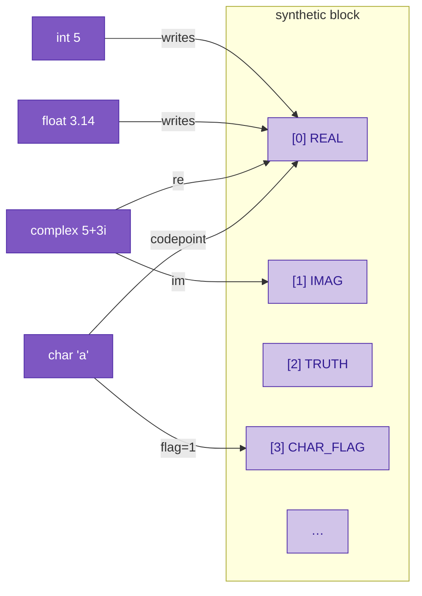

# Numeric math

Most languages treat `int`, `float`, and `complex` as three separate types with three separate arithmetics and three separate conversion rules. Sutra collapses them into one. **Every number lives on the same two coordinates of the extended-state vector** — the real axis and the imaginary axis — and the type tag just tells the compiler which parts of that representation you're promising to use. Multiplication, addition, and everything else downstream are defined once, on the underlying vector, and reduce correctly for the narrower types because their imaginary parts are zero.

The practical consequence: **complex numbers are handled isomorphically with int and float.** There's no "fallback to complex when the types escalate" and no wrapper class. A complex is a real number that happens to have populated its imaginary coordinate too.

---

## The two numeric axes



| class | real axis | imag axis | compile-time rule |
|---|---|---|---|
| `int` | value | 0 | reject fractional / imaginary literals |
| `float` | value | 0 | allow fractional, reject imaginary |
| `complex` | re | im | allow both |
| `char` | code point | 0 | int + flag bit on `synthetic[3]` |

`int ⊂ float ⊂ complex` as a chain of compile-time restrictions on the same runtime storage. No conversion operation is needed between them at runtime — the bits are already there.

---

## Literals

All the ways to write numeric values in `.su` source:

```c
// ints — no fractional, no imaginary
int n = 42;
int hex_codepoint = 'A';              // char literal in int-typed slot

// floats — fractional allowed
float pi = 3.14159;

// imaginary — `i` suffix directly after a numeric literal
complex j = 5i;                        // 0 + 5i
complex pi_i = 3.14i;                  // 0 + 3.14i

// complex — int + imag, float + imag, all fold at compile time
complex c1 = 5 + 5i;                   // 5 + 5i
complex c2 = 2.5 + 1.5i;               // 2.5 + 1.5i
complex c3 = 5 - 3i;                   // 5 - 3i  (unary minus folded)
complex c4 = -5i;                      // 0 - 5i

// `i` as a variable name still works — the suffix only binds when
// the next character is NOT an identifier continuation.
vector i = basis_vector("index");
vector scaled = 5 * i;                 // ordinary multiplication of 5 by i
```

The `i` suffix is a **literal disambiguation rule in the lexer**: `5i` is one token (imaginary literal), `5 * i` is three tokens (literal, operator, identifier). Same pattern as numeric suffixes in Rust / C#. The lexer peeks one character past the `i` and only consumes it as a suffix when the next char isn't alphanumeric or underscore.

### Compile-time folding

`5 + 5i` is parsed as a binary `+` of an `IntLiteral` and an `ImaginaryLiteral`. Before codegen, the simplifier folds this into a single `ComplexLiteral(re=5, im=5)`. Runtime emission is one allocation:

```
5 + 5i      →      _VSA.make_complex(5.0, 5.0)
```

This is the same simplifier pass that handles `5 - 5i`, `5i + 3`, `5i - 2i` (→ `ImaginaryLiteral(3)`), unary minus, and parenthesized wrappers. Programs never pay a runtime cost for writing the natural form of a complex literal.

---

## Arithmetic: the isomorphism

The idea is that **one multiplication rule handles all three classes**. Complex multiplication on `(re, im)` pairs reduces cleanly for real-only inputs:

```
(r₁ + 0i) · (r₂ + 0i) = r₁ · r₂ + 0i
```

So `int * int` and `float * float` are just "complex multiply where both sides happen to have zero imaginary part." The compiler doesn't need a separate arithmetic for narrower types; it just uses the general rule, and the zeros propagate.

For vectors in the extended-state layout, complex multiplication works out to:

```
real(a * b)  =  a.real · b.real  −  a.imag · b.imag
imag(a * b)  =  a.real · b.imag  +  a.imag · b.real
```

This is a pure polynomial computation on the two coordinates — differentiable everywhere, CUDA-friendly, no branches. Addition is easier: componentwise vector addition on the `(real, imag)` axes is exactly complex addition.

### Shipped vs. pending (be honest about where we are)

The **representation** side is fully shipped:

- Literals (`5`, `3.14`, `5i`, `5 + 5i`, `−5i`, `5i + 3`, etc.) all parse, fold at compile time, and produce the correct complex-plane vectors.
- `make_complex(re, im)`, `make_real(x)`, and the real / imag accessors work on numpy and pytorch backends.
- The type tag (`int` / `float` / `complex`) is recognized by the parser and validator.

The **arithmetic** side is partial:

| operation | status |
|---|---|
| `complex + complex` | **works** (vector addition equals componentwise complex addition — they're the same operation) |
| `real literal + complex variable` | **works via broadcast** on the numpy backend, but emits Python `+` which is numpy broadcast |
| `complex * complex` | **BROKEN** — emits element-wise `a * b`, which gives `(r₁r₂, i₁i₂)` instead of the correct `(r₁r₂ − i₁i₂, r₁i₂ + i₁r₂)` |
| `int * int` on int-typed slots | emits Python scalar `*` — correct numerically, but not yet on-substrate |
| `int / float → complex promotion` in mixed expressions | not yet folded |

That gap is on the road map. The design target is: `BinaryOp('*')` between two number-family values emits a single `_VSA.complex_mul(a, b)` call that computes the complex product via substrate vector arithmetic, regardless of whether either side is actually int, float, or complex.

When that lands, the observable behavior is: `complex c = (5 + 5i) * (3 + 2i)` produces `5 + 25i`, and `int n = 5 * 3` produces `15`, and they go through **one code path**.

---

## Why the isomorphism matters

Three reasons this pays off beyond "clean design":

**1. No type-escalation rules.** A C++ or Python programmer can tell you when `int * int` becomes `long`, when `float + int` becomes `float`, when `complex + float` becomes `complex`. Those rules are a pile of special cases. In Sutra they aren't rules — they're facts about the data. A `complex` with `imag=0` *is* a `float`; the tag just narrows what the compiler will let you do with it.

**2. Operations are polynomial, not branching.** Complex multiplication via `real(a*b), imag(a*b)` formulas is four scalar products and two sums. No case analysis on which operand is "the complex one." No phi nodes. Everything composes into a pure polynomial expression a simplifier can manipulate and autograd can differentiate.

**3. Every number is on the complex plane.** Mathematically this is already how numbers work — the reals are a subset of the complex plane — but programming languages typically pretend otherwise. Sutra's representation matches the math. `Re(z)` and `Im(z)` are just axis reads; `|z|²` is `a · a`; `conjugate(z)` flips the imag axis. All standard linear operations.

---

## Char literals reuse the number axis

A character is "an integer with a flag." The code point goes on `synthetic[AXIS_REAL]` — the same axis as `int` — and `synthetic[AXIS_CHAR_FLAG]` gets set to `1.0` to distinguish `'a'` (97-with-flag) from the plain int `97`.

```c
char c = 'a';        // code point 97, flag 1.0
int n = 97;          // code point 97, flag 0.0
// c and n have identical real axes. Arithmetic operations share
// the same rule; the flag is metadata a downstream check can read.
```

This is the same "primitive class = compile-time tag on shared storage" pattern as the numeric hierarchy and the bool / fuzzy / trit hierarchy. It's the idea Sutra builds the type system out of.

---

## Summary

- **One representation** — `(real, imag)` on `synthetic[0..1]` — carries every number.
- **Literals parse and fold to this representation** at compile time (`5i`, `5+5i`, `3.14`, all → single `make_complex` allocations).
- **Complex ⊃ float ⊃ int** as a chain of compile-time restrictions, not a chain of runtime conversions.
- **One multiplication rule** — complex multiply — is the target for all numeric `*`. When imag parts are zero, it's scalar multiply. (Currently half-shipped; complex addition works, complex multiplication needs a dedicated runtime call.)
- **Differentiable and CUDA-capable** end to end, same as the logic layer.

---

## Related reading

- [Primitive classes](primitive-classes.md) — the unifying "everything is a vector" picture.
- [Logical operations](logical-operations.md) — the truth-axis analog of this story.
- [Literals and auto-embedding design](https://github.com/EmmaLeonhart/Sutra/blob/master/planning/open-questions/literals-and-auto-embedding.md) — the spec-level capture of the literal set including the imaginary suffix and the complex-multiplication follow-on.
- [`tests/corpus/valid/30_imaginary_literal.su`](https://github.com/EmmaLeonhart/Sutra/blob/master/sdk/sutra-compiler/tests/corpus/valid/30_imaginary_literal.su) — the `5i` family of literals.
- [`tests/corpus/valid/31_complex_type.su`](https://github.com/EmmaLeonhart/Sutra/blob/master/sdk/sutra-compiler/tests/corpus/valid/31_complex_type.su) — complex-typed variables and compile-time coercion.
