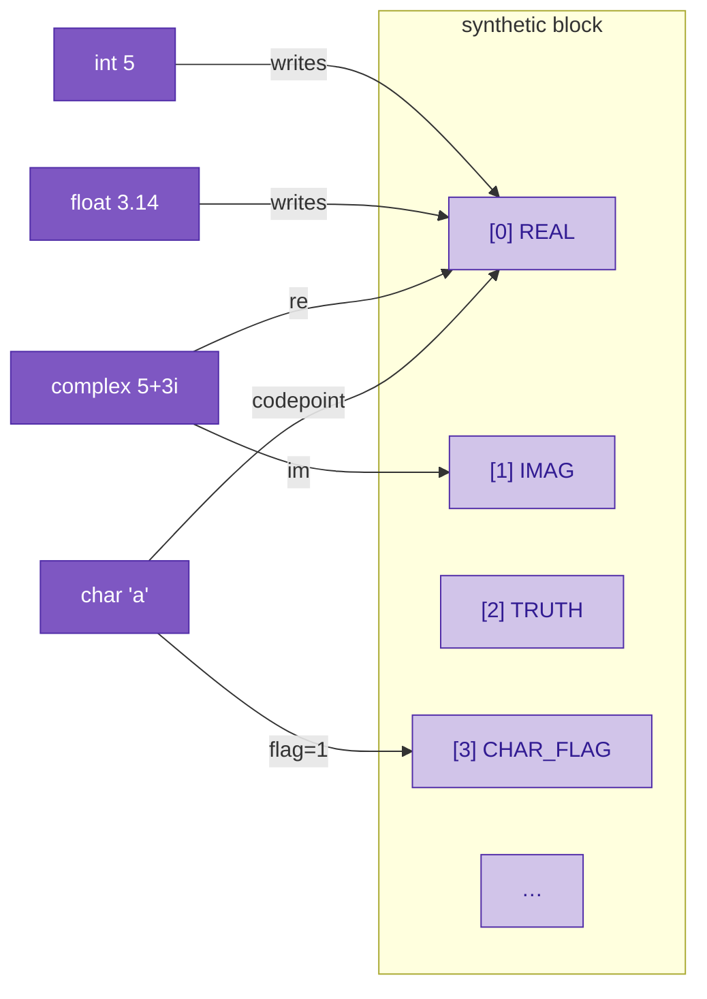

# Numeric math

Most languages treat `int`, `float`, and `complex` as three separate types with three separate arithmetics and three separate conversion rules. Sutra collapses them into one. **Every number lives on the same two coordinates of the extended-state vector** — the real axis and the imaginary axis — and the type tag just tells the compiler which parts of that representation you're promising to use. Multiplication, addition, and everything else downstream are defined once, on the underlying vector, and reduce correctly for the narrower types because their imaginary parts are zero.

The practical consequence: **complex numbers are handled isomorphically with int and float.** There's no "fallback to complex when the types escalate" and no wrapper class. A complex is a real number that happens to have populated its imaginary coordinate too.

---

## The two numeric axes



| class | real axis | imag axis | compile-time rule |
|---|---|---|---|
| `int` | value | 0 | reject fractional / imaginary literals |
| `float` | value | 0 | allow fractional, reject imaginary |
| `complex` | re | im | allow both |
| `char` | code point | 0 | int + flag bit on `synthetic[3]` |

`int ⊂ float ⊂ complex` as a chain of compile-time restrictions on the same runtime storage. No conversion operation is needed between them at runtime — the bits are already there.

---

## Literals

All the ways to write numeric values in `.su` source:

```c
// ints — no fractional, no imaginary
int n = 42;
int hex_codepoint = 'A';              // char literal in int-typed slot

// floats — fractional allowed
float pi = 3.14159;

// imaginary — `i` suffix directly after a numeric literal
complex j = 5i;                        // 0 + 5i
complex pi_i = 3.14i;                  // 0 + 3.14i

// complex — int + imag, float + imag, all fold at compile time
complex c1 = 5 + 5i;                   // 5 + 5i
complex c2 = 2.5 + 1.5i;               // 2.5 + 1.5i
complex c3 = 5 - 3i;                   // 5 - 3i  (unary minus folded)
complex c4 = -5i;                      // 0 - 5i

// `i` as a variable name still works — the suffix only binds when
// the next character is NOT an identifier continuation.
vector i = basis_vector("index");
vector scaled = 5 * i;                 // ordinary multiplication of 5 by i
```

The `i` suffix is a **literal disambiguation rule in the lexer**: `5i` is one token (imaginary literal), `5 * i` is three tokens (literal, operator, identifier). Same pattern as numeric suffixes in Rust / C#. The lexer peeks one character past the `i` and only consumes it as a suffix when the next char isn't alphanumeric or underscore.

### Compile-time folding

`5 + 5i` is parsed as a binary `+` of an `IntLiteral` and an `ImaginaryLiteral`. Before codegen, the simplifier folds this into a single `ComplexLiteral(re=5, im=5)`. Runtime emission is one allocation:

```
5 + 5i      →      _VSA.make_complex(5.0, 5.0)
```

This is the same simplifier pass that handles `5 - 5i`, `5i + 3`, `5i - 2i` (→ `ImaginaryLiteral(3)`), unary minus, and parenthesized wrappers. Programs never pay a runtime cost for writing the natural form of a complex literal.

---

## Arithmetic: the isomorphism

The idea is that **one multiplication rule handles all three classes**. Complex multiplication on `(re, im)` pairs reduces cleanly for real-only inputs:

```
(r₁ + 0i) · (r₂ + 0i) = r₁ · r₂ + 0i
```

So `int * int` and `float * float` are just "complex multiply where both sides happen to have zero imaginary part." The compiler doesn't need a separate arithmetic for narrower types; it just uses the general rule, and the zeros propagate.

For vectors in the extended-state layout, complex multiplication works out to:

```
real(a * b)  =  a.real · b.real  −  a.imag · b.imag
imag(a * b)  =  a.real · b.imag  +  a.imag · b.real
```

This is a pure polynomial computation on the two coordinates — differentiable everywhere, CUDA-friendly, no branches. Addition is easier: componentwise vector addition on the `(real, imag)` axes is exactly complex addition.

### Efficient 2D complex multiplication

Because every number lives in a 2-dimensional subspace of the full 868-dim extended-state vector (only `real` and `imag` carry content), complex multiplication doesn't need to do O(d²) matmul on the full vector. The runtime reads the four relevant scalars, computes the 2D product directly, and writes a fresh vector:

```
real(a * b)  =  a.real · b.real  −  a.imag · b.imag
imag(a * b)  =  a.real · b.imag  +  a.imag · b.real
```

Constant-time regardless of ambient dimension. Real-only inputs (imag parts zero) reduce to the single `a.real · b.real` term — the isomorphism with scalar multiplication holds automatically.

### Shipped status

- Literals (`5`, `3.14`, `5i`, `5 + 5i`, `−5i`, `5i + 3`, etc.) parse, fold at compile time, and produce the correct complex-plane vectors.
- `complex + complex` works — vector addition on the real/imag axes equals componentwise complex addition (they're the same operation).
- `complex * complex` works — dispatches to `_VSA.complex_mul` when either operand is provably complex at compile time (literal, complex-typed variable, or an arithmetic expression involving one of those).
- `int_literal * complex_var` and `complex_var * int_literal` work via scalar promotion inside `complex_mul`: Python ints / floats get auto-lifted to `make_real` vectors before the product.
- `int * int` and `float * float` on purely real-typed slots stay on the Python scalar fast path. The type-directed dispatch only routes through `complex_mul` when complex content is statically provable, so simple arithmetic has zero vector-boxing overhead.

Empirical verification on the classic cases (from `tests/corpus/valid/36_complex_multiplication.su`):

| expression | result | expected |
|---|---|---|
| `(5 + 5i) * (3 + 2i)` | `5 + 25i` | ✓ |
| `7 * 4` on complex-typed | `28` | ✓ |
| `(5i) * (3i)` | `-15` | ✓ |
| `(2 + 3i) * 4` | `8 + 12i` | ✓ |
| `4 * (2 + 3i)` | `8 + 12i` | ✓ |
| `(2 + 3i) * 2i` | `-6 + 4i` | ✓ |
| `(5 + 5i) + (3 + 2i)` | `8 + 7i` | ✓ |
| `5 * 3` (plain int) | `15` as Python int | ✓ |

### Pending

- `complex - complex` — currently emits vector subtraction, which works for pure complex-complex subtraction but broadcasts wrong for `complex_var - scalar`. Same fix pattern as multiplication: dispatch through a `complex_sub` runtime when either operand is complex.
- `complex / complex` — division not yet implemented. Natural form: `(a · conjugate(b)) / |b|²`.
- Conjugate, modulus, and other standard complex operations as runtime methods.

---

## Why the isomorphism matters

Three reasons this pays off beyond "clean design":

**1. No type-escalation rules.** A C++ or Python programmer can tell you when `int * int` becomes `long`, when `float + int` becomes `float`, when `complex + float` becomes `complex`. Those rules are a pile of special cases. In Sutra they aren't rules — they're facts about the data. A `complex` with `imag=0` *is* a `float`; the tag just narrows what the compiler will let you do with it.

**2. Operations are polynomial, not branching.** Complex multiplication via `real(a*b), imag(a*b)` formulas is four scalar products and two sums. No case analysis on which operand is "the complex one." No phi nodes. Everything composes into a pure polynomial expression a simplifier can manipulate and autograd can differentiate.

**3. Every number is on the complex plane.** Mathematically this is already how numbers work — the reals are a subset of the complex plane — but programming languages typically pretend otherwise. Sutra's representation matches the math. `Re(z)` and `Im(z)` are just axis reads; `|z|²` is `a · a`; `conjugate(z)` flips the imag axis. All standard linear operations.

---

## Char literals reuse the number axis

A character is "an integer with a flag." The code point goes on `synthetic[AXIS_REAL]` — the same axis as `int` — and `synthetic[AXIS_CHAR_FLAG]` gets set to `1.0` to distinguish `'a'` (97-with-flag) from the plain int `97`.

```c
char c = 'a';        // code point 97, flag 1.0
int n = 97;          // code point 97, flag 0.0
// c and n have identical real axes. Arithmetic operations share
// the same rule; the flag is metadata a downstream check can read.
```

This is the same "primitive class = compile-time tag on shared storage" pattern as the numeric hierarchy and the bool / fuzzy / trit hierarchy. It's the idea Sutra builds the type system out of.

---

## Summary

- **One representation** — `(real, imag)` on `synthetic[0..1]` — carries every number.
- **Literals parse and fold to this representation** at compile time (`5i`, `5+5i`, `3.14`, all → single `make_complex` allocations).
- **Complex ⊃ float ⊃ int** as a chain of compile-time restrictions, not a chain of runtime conversions.
- **One multiplication rule** — complex multiply — is the target for all numeric `*`. When imag parts are zero, it's scalar multiply. (Currently half-shipped; complex addition works, complex multiplication needs a dedicated runtime call.)
- **Differentiable and CUDA-capable** end to end, same as the logic layer.

---

## Transcendental functions: compile-time tensor approximation

Most languages handle `log`, `sqrt`, `sin`, `exp`, etc. by deferring to a runtime math library (`libm`, IEEE 754, libopenlibm). Sutra's design intent is the opposite: **compile transcendental functions into tensor operations at compile time**, with the precision contract set per project rather than per platform.

The underlying observation is the **Kolmogorov–Arnold representation theorem** — any continuous bounded multivariate function decomposes into a finite composition of univariate functions. Univariate functions of one variable are already in KART normal form, which means there's a uniform compilation strategy for all of them: approximate as a tensor op on a bounded domain, with the polynomial degree or table resolution chosen by a precision setting.

### Three compilation tiers

The compiler picks one based on type information and the project-level precision setting:

1. **Exact (closed linear form)** — the function has a direct matrix-op representation. Emit it directly.
2. **Chebyshev polynomial approximation** — for a smooth function on a bounded domain, evaluate as `dot(coefficients, [x, x², …, x^n])` where the polynomial degree is set to hit the configured precision. This is exact up to the precision contract — `log(x)` on `[0.01, 10]` becomes a vector of Chebyshev coefficients dotted against a vector of basis evaluations.
3. **Lookup table + interpolation** — for weird or expensive functions, discretize into a table. Interpolation is a sparse matrix-vector product; in Sutra this is essentially free because everything is already living in tensor land — a lookup is just matrix-row selection on a tensor that's right there. (Other languages pay a pointer dereference + cache miss + branch for interpolation; Sutra doesn't switch representation, so the "table" is just another tensor.)

A fourth tier — CORDIC-style decompositions into shifts and adds — exists for hardware-targeted backends but is not exposed at the language level today.

### The precision contract lives in `atman.toml`

The user controls the tradeoff explicitly per project:

```toml
[math]
approximation_precision = 1e-6        # target abs error
approximation_method = "chebyshev"    # or "lookup" or "cordic"
```

Different projects make different choices. A physics simulation wants 1e-12; a game engine wants 1e-3 and maximum speed. The compiler reads these settings, picks the polynomial degree (or table resolution) that hits the precision target, and emits the chosen tensor op. **The user writes `sqrt(x)` and the compiler picks the tier.** No runtime dispatch, no math-library call.

This is a different philosophy from F# / Julia / most languages, which fix the precision at IEEE 754 and route through libm at runtime. Sutra makes precision a compile-time architectural decision that the compiled tensor reflects directly. For finance / regulatory / GPU-deployment work, that's a meaningful contrast — the compiled tensor is inspectable and deterministic in a way a JIT-compiled libm call chain isn't.

### Status

Aspirational as of 2026-04-25. The compiler doesn't currently have a transcendental-function approximation pass, and `atman.toml`'s `[math]` section is not parsed. Tracked in `todo.md` under "[This year] Compile-time math function approximation."

---

## Related reading

- [Primitive classes](primitive-classes.md) — the unifying "everything is a vector" picture.
- [Logical operations](logical-operations.md) — the truth-axis analog of this story.
