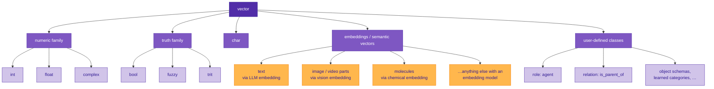

# The ontology

Sutra has a class system. Everything in the language is a vector, and new classes inherit from `vector` or from each other. That much is conventional object-oriented programming.

What makes it unconventional is **what the hierarchy is for.** In a typical OOP language, the class tree is a *code organization* tool — you put shared behavior on a parent class and specializations on children. In Sutra, the class tree is a map of *what kinds of things can exist in the vector space*. Each class is a claim about which axes of the extended-state vector carry meaning for values of that class, and which operations are valid on them.

That's an ontology, not a type system. The word isn't borrowed metaphorically — it's the same sense used in knowledge representation (OWL, RDF), information science, and formal philosophy: a structured account of what exists and how the things that exist relate. Sutra's "class tree" is a small ontology, and it's designed to connect to larger external ontologies through the embedding layer.

This page walks through the ontology top-down.

---

## The root: vector



Every node in this tree is a vector. What changes going down the tree is **which parts of the vector carry meaning** and **which operations are defined on it**. The `vector` itself is the bare substrate — a flat array of real numbers (868-dimensional in the demo) — with no semantic claims about what any of it means. Every subclass is a commitment about structure.

---

## Internal vector types — the left side of the tree

These are the classes where the language knows the full interpretation of every relevant axis.

### Numeric family (`int`, `float`, `complex`)

Values occupy the real and imaginary synthetic axes (`synthetic[0]` and `synthetic[1]`). The class tag tells the compiler what to permit:

- `int` — real axis only; fractional and imaginary literals are rejected.
- `float` — real axis only; fractional literals allowed.
- `complex` — both real and imaginary axes.

One multiplication rule (the complex product) covers all three — when the imaginary parts are zero it reduces to scalar multiplication. See [Numeric math](numeric-math.md) for the details.

### Truth family (`bool`, `fuzzy`, `trit`)

Values occupy the truth axis (`synthetic[2]`). All three are views of the same coordinate, differentiated by what defuzzification does:

- `bool` — expected at the poles (±1); `defuzzify` snaps there.
- `fuzzy` — any value in `[-1, +1]`; `defuzzify` still polarizes to the two poles.
- `trit` — any value in `[-1, +1]` with `0` as a first-class neutral attractor; `defuzzify_trit` preserves the middle.

See [Primitive classes](primitive-classes.md) and [Logical operations](logical-operations.md) for the details.

### `char`

A character is an integer with a flag: code point at the real axis (same as `int`), and a `1.0` at a dedicated char-flag axis (`synthetic[3]`) that lets downstream code distinguish `'a'` from the plain int `97`.

---

## Embeddings — the right side of the tree

This is the interesting half.

An **embedding** is a vector produced by a model that has been trained to place similar things near each other in some high-dimensional space. Text embeddings are the most familiar kind — a model like [nomic-embed-text](https://docs.nomic.ai/embeddings/) takes a string and produces a 768-dimensional vector such that `"cat"` and `"kitten"` are close together in the space, and both are far from `"algebra"`.

But text is just the most convenient example. Models exist that do the same thing for:

- **Images** (CLIP, SigLIP) — a picture of a cat and the word "cat" land near each other.
- **Parts of images** (SAM-style segment embeddings) — a specific object in a picture gets its own vector.
- **Video clips** (VideoCLIP and successors) — a motion pattern embedded as a vector.
- **Audio** (Whisper-style acoustic embeddings).
- **Molecules** (MolFormer, ChemBERTa) — a chemical structure as a vector, with similar structures near each other.
- **Code** (StarCoder-style code embeddings) — semantically-equivalent code snippets cluster.
- **Proteins**, **genomes**, **brain recordings** — anywhere a sufficiently-trained model exists.

For Sutra, all of these are the same kind of thing: they're *branches of the ontology tree under the `vector` root that don't have a specific internal interpretation the way `int` or `bool` do*. Instead, they inherit their structure from whatever model produced them, and the language knows how to operate on them — similarity, binding, bundling — via the substrate operations.

### The semantic claim

This is where the language makes a strong statement: **an embedding is a representation of the thing itself, not of a name for the thing.**

When Sutra writes

```c
vector cat = "cat";
```

the `vector` variable holds a vector in the frozen LLM's embedding space. That vector isn't pointing at the word "cat" as a string — it's pointing at a location in a geometric space that the LLM has arranged so that "cat-nearby" things (kittens, meows, whiskers) are literally geometrically nearby. The variable is the closest thing this language has to "the concept of a cat, as a value."

This is why every operation in the language works on vectors: there's no "looking things up in a dictionary by string key" layer, because the string never entered the language in the first place. The value is always geometric, and the operations are always geometric.

### What's open about embeddings

We don't know the best way to use embeddings in a programming language yet. This language is an exploration of what becomes possible when a programming language can directly manipulate vectors in a frozen LLM's space, and the exploration is early.

What we have committed to:

- The four-operation core — `bind`, `unbind`, `bundle`, `similarity` — is well-understood from the VSA / hyperdimensional-computing literature and carries over essentially unchanged to frozen-LLM vectors.
- Cosine similarity between embeddings is a useful truth signal (this is what makes `a == b` work as a fuzzy-valued operator).
- Control flow through embeddings can be written as algebra rather than branching (see [Memory without control flow](memory.md)).

What we're still figuring out:

- How much structure in the embedding space is *reliably usable* vs. an artifact of a specific model. The cartography work in the sibling repo has empirical findings here, some of which hold up across models and some of which don't.
- Which VSA operations keep working when the vectors are trained embeddings instead of random hyperdimensional vectors. Some work beautifully; some fall apart. We know binding and bundling carry over; we know rotation-as-role does in 768-d; we're less sure about some of the more exotic primitives.
- How to make the language's type system aware of *which* embedding space a value lives in. A nomic vector and a CLIP vector shouldn't be mixed silently. The current implementation has one default model and a single-substrate compile-time declaration; a richer multi-substrate type system is on the roadmap.

The ontology is a *structural* commitment, not a semantic one. The structure is: vector → (internal primitive classes) and (embedding classes). The specific ways you use the embedding branch are still being invented.

---

## Emerging classes: the inverse of OOP

Before getting to user-defined classes, the conceptual move that makes Sutra's ontology different from every object-oriented type system:

> **In traditional OOP, the programmer creates classes, and data is made to conform to them.**
>
> **In Sutra, classes already exist in the embedding model's latent space, and the programmer organizes, names, and refines the structure that is already there.**

The frozen LLM (or vision model, or molecular model) has, by the time Sutra gets to it, already processed a vast amount of data and arranged its output space so that similar things cluster together. There is already a region of the space where "cats" live — kittens, whiskers, purring, feline-ness — geometrically grouped. There is already a region where "anger" lives, where "iron" lives, where "ascending chord progression" lives. The clustering *is not something the Sutra program invents.* It's the structure the embedding model carries into the program from its training.

The programmer's job — what `class` declarations are *for* in this language — is not to make new things exist. It's to:

1. **Name** a region of space that already has coherence. "Here is where the cats are; call this `Cat`."
2. **Carve** the region more precisely than the raw model's clustering. "Within the cat region, this sub-cluster is `HouseCat`; this other one is `WildCat`." The model may or may not have made this distinction on its own; the programmer's declaration is a commitment to treat the sub-regions separately.
3. **Connect** regions to each other through roles and relations. "A `HouseCat` stands in the `pet_of` relation to a `Human`." The relation is itself a learned transformation between the regions.
4. **Override** the model's default behavior on a region when it's wrong. "The model thinks `tomato` is closer to `fruit` than to `vegetable`, but for our purposes, this application treats it as `vegetable`." This is where the override semantics come in.

The steps go from *discover* to *organize* to *refine*. The programmer is curating a pre-existing map, not drawing one on a blank page.

### Worked example: countries and their capitals

Consider the `Country` concept. Countries exist in the embedding space — "France," "Japan," "Brazil," "Norway" all cluster together geometrically, because the model saw enough similar contexts to place them near each other. A programmer didn't put them there; the model did, during training.

Capitals also exist as a cluster — "Paris," "Tokyo," "Brasília," "Oslo" occupy their own region.

The more interesting claim is that the *relation* between them exists in the space too. Take the displacement vectors:

```
Paris    − France    ≈ some vector v_capital
Tokyo    − Japan     ≈ the same vector v_capital
Brasília − Brazil    ≈ the same vector v_capital
Oslo     − Norway    ≈ the same vector v_capital
```

This is the famous "king − man + woman ≈ queen" pattern, applied to the (country, capital) pair. The vector `v_capital` is *the `capital_of` relation*, sitting in the embedding space as a geometric object that you can discover empirically by averaging many such displacements from known pairs.

Now the Sutra programmer's job becomes concrete:

1. **Discover** the relation. Average the `capital − country` displacements from a small seed set of known pairs. Check that the resulting vector `v_capital`, applied to a fresh country, actually lands near that country's real capital.
2. **Name** it. Bind `v_capital` to the identifier `capital_of` in the program.
3. **Organize** it into the `Country` class as a method:

   ```c
   class Country inherits vector {
       function Capital get_capital() {
           return this + capital_of;
       }
   }
   ```

4. **Refine / override** if the model is wrong. The model might place "Wellington" closer to "New Zealand" than the displacement predicts, or confuse "Canberra" for "Sydney." The programmer can supply explicit overrides for known edge cases, or fit a learned-matrix version of `capital_of` on a larger training set to improve accuracy.

What happened in this example:

- The `Country` class didn't create the category "Country" — that was already a coherent region of the embedding space.
- The `capital_of` function wasn't written with an if-else dispatch over every known country — it's a *single vector*, discovered by averaging, that does the job for any country the model has embedded.
- The `get_capital()` method is three characters long (`+`) because the hard work was already done by the embedding model during training. The programmer's code is a thin layer that *names and composes* what was already there.

That's the inversion. OOP would have you build `capital_of` as a hashmap of country names to capital names. Sutra has you discover a geometric transformation that encodes the same information more compactly, generalizes to unseen countries, and composes with other relations (you could then ask "what is the capital of the country that speaks Portuguese" by composing `speaks_of⁻¹` with `capital_of`).

### Why this matters practically

Three consequences of this inversion that keep coming up:

- **You can query the ontology before you've written any class.** "Which embedding is closer to `"apple"` — `"fruit"` or `"car"`?" is a meaningful question before any `Fruit` or `Vehicle` class exists. The embedding space already has the answer.
- **Classes can be *wrong* in a way traditional OOP classes cannot.** An OOP `Dog` class is correct by fiat — whatever fields and methods you put on it is what `Dog` means for your program. A Sutra `Dog` class makes a claim about *where in the embedding space `Dog` sits*, and that claim can disagree with the model's own clustering, or with another model's, or with reality. Classes have truth conditions.
- **Class boundaries are probabilistic, not discrete.** A value is a `HouseCat` to some degree (by similarity to the class's prototype vector), not absolutely. The `instanceof` question is a fuzzy value on the truth axis — it defuzzifies to a three-valued answer `{yes, no, unknown}` rather than a Boolean.

This is why we called the top-level structure an **ontology** and not a type hierarchy. A type hierarchy organizes code. An ontology organizes *what exists* — and in Sutra the "what exists" is the pre-existing geometric structure of a trained model's latent space.

### The connection to OWL and knowledge representation

This framing isn't invented here. It's the same move the semantic-web community made with RDF and OWL in the early 2000s: define ontologies that describe real-world categories and their relationships, rather than program-internal classes that describe code structure. The difference is that OWL ontologies assert categorical facts in a symbolic logic (closed-world or open-world, triple-based), while Sutra's ontology asserts *geometric* facts in a frozen model's embedding space. The logical operations still exist (all the fuzzy-logic machinery works on ontology queries), but the substrate is continuous rather than symbolic.

A Sutra program is, in a real sense, a small ontology *about* a large embedded ontology. The small one is the code you write; the large one is the model's learned latent space. Sutra's class declarations are the glue.

---

## User-defined classes

A Sutra program can define its own classes that inherit from `vector` or from any existing class. A class declaration is essentially a statement about which axes of the vector carry meaning for values of that class, plus any operators the class overrides.

Three categories show up repeatedly:

1. **Roles** — things like `agent`, `location`, `object-of-sentence`. A role is a class whose values are rotation matrices (or, in the future, learned matrices) that act on other vectors via `bind`. `role Agent = ...; bind(Agent, cat)` places `cat` in the agent slot.
2. **Relations** — `is_parent_of`, `causes`, `implies-conceptually`. A relation is a learned transformation that takes one vector and produces another. This is the "predicate" layer of the ontology.
3. **Schemas** — compound structures like `Person { name, age, occupation }`. These are bundles of role-filler bindings, and the language treats them as vectors that can be bound, unbound, and compared like any other vector.

This is where Sutra's ontology connects to traditional knowledge-representation ontologies. OWL-style `Class(Person) hasPart(name, string) hasPart(age, int)` translates directly into a Sutra class with role-bindings for each field. The difference is that Sutra's classes live in embedding space, so a `Person` value doesn't just *satisfy* the schema — it's geometrically located near other `Person`s, and operations like similarity between two `Person` values are meaningful.

We are early in exploring this.

### MVP declaration form (2026-04-25)

The minimum viable surface landed in commit-set 2026-04-25:

```sutra
class Embedding extends vector { }
class Object extends Embedding { }
class Animal extends Object { }
class Cat extends Animal { }
```

What this gives you today:

- A `class Name extends Parent { }` declaration form. Parsed, validated, codegen'd.
- **Single inheritance.** Each class has exactly one parent.
- **The chain must bottom out at a primitive** (vector / int / float / fuzzy / etc.). The validator walks the chain at compile time and emits a diagnostic if a parent is unknown.
- **Empty bodies only.** Methods, fields, and operator implementations inside the braces are rejected with a pointer at the deferred ontology work in `todo.md`.
- **Compile-time-only metadata.** At runtime, an instance of `Cat` is a plain vector — no extra storage, no runtime class tag, no dispatch overhead. The class name flows through the type system; the codegen skips `ClassDecl` nodes entirely.
- **Forward references aren't supported.** `class Foo extends Bar` requires `Bar` to be either a primitive or a class declared earlier in the file.

Diagnostic codes for class-decl errors: `SUT0140` (non-empty body), `SUT0141` (duplicate name), `SUT0142` (extends-target unknown).

Working example at `examples/classes_demo.su`. Corpus tests at `sdk/sutra-compiler/tests/corpus/{valid/class_declarations.su, invalid/17_class_extends_unknown.su, invalid/18_class_duplicate.su, invalid/19_class_with_body.su, invalid/20_class_no_extends.su}`.

What is **deferred**:

- **Instance behavior beyond "is a vector."** No constructor surface, no field declarations, no per-class storage layout decisions.
- **Methods on user classes.** The `method` keyword parses, but `MethodDecl` codegen is rejected with `"method declarations are not supported by the V1 codegen."` Same rejection applies inside a class body.
- **Operator implementations on a class.** The path that makes `Dollar + Dollar` work but `Dollar + Euro` not work — the F#-units-of-measure replacement story — is not in.
- **Generics.** `class Foo<T> extends Bar { }` and `function T Identity<T>(T x)` both parse but codegen rejects them.

These are tracked in `todo.md` § "Ontology — make the class system real."

---

## Why call it an ontology

To circle back to the naming question:

- A **type system** tells the compiler which operations it's allowed to emit.
- A **class hierarchy** tells the programmer how to organize code.
- An **ontology** tells both what *kinds of things can exist* in a representation, and how those kinds *relate* to each other.

Sutra's class tree does the first two by virtue of being a type system + class hierarchy in the usual programming sense. It does the third because the representation IS vectors in embedding space, and the tree is describing which regions of that space are "allowed" for each class. The numeric family occupies two specific axes; the truth family occupies one; embeddings occupy the semantic block; user-defined classes carve out further structure via role bindings.

"Ontology" captures that third sense. "Type hierarchy" or "class hierarchy" doesn't — those words assume the hierarchy is just organizing syntax. Sutra's hierarchy is organizing *geometry*, and geometry in embedding space means "the structure of what exists."

---

## Related reading

- [Primitive classes](primitive-classes.md) — the numeric and truth families in detail.
- [Logical operations](logical-operations.md) — the truth-family arithmetic.
- [Numeric math](numeric-math.md) — the numeric-family arithmetic.
- [Memory without control flow](memory.md) — how binding / bundling replace traditional array and hashmap control flow, using only the substrate's algebra.
- [Hello Sutra tutorial](tutorials/01-hello-sutra.md) — a first program using the embedding layer.
