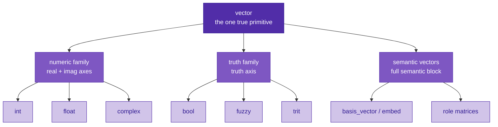
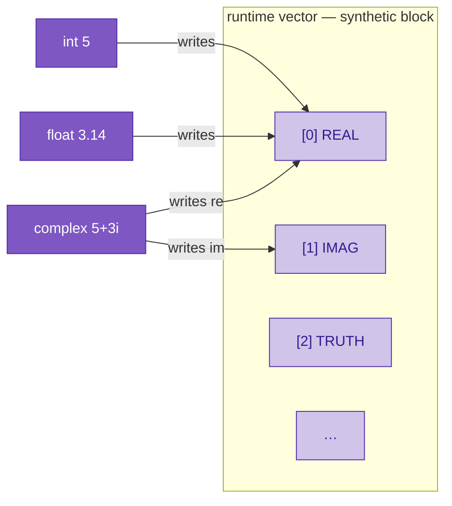
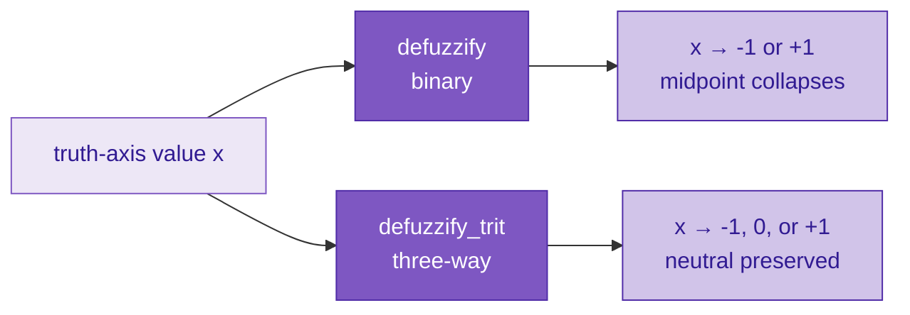
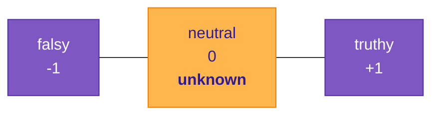
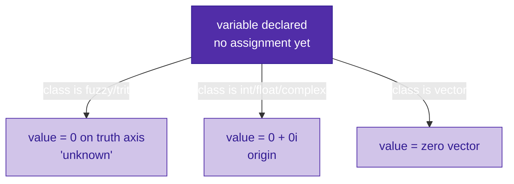

# Primitive classes

In Sutra, there is really only **one** primitive. Everything is a vector in the extended-state layout — a flat array of coordinates where some coordinates carry semantic content from the embedding model and some carry computational/symbolic state.

Everything else you think of as a "type" — `int`, `float`, `complex`, `bool`, `fuzzy`, `trit`, `char` — is what we call a **primitive class**: a compile-time tag that tells the compiler *which coordinates of the vector carry meaning for this value* and *what rules apply when you operate on it*. The runtime data is the same shape no matter which class you pick; the class names just tell you (and the compiler) what part of that shape you actually care about.

This is why Sutra's type system can feel simpler and weirder than most — there's no "primitive vs. object" distinction at the bottom of the hierarchy. It's vectors all the way down.

---

## The class hierarchy

The left two branches are what this page is about. The semantic branch is covered in the [hello-sutra tutorial](tutorials/01-hello-sutra.md) and the bind/unbind work.

---

## The numeric family

`int`, `float`, and `complex` all put their value on the same pair of synthetic axes — `AXIS_REAL` and `AXIS_IMAG`. They're the same data. The only difference is the compile-time tag.

| Class | Real axis | Imag axis | Compile-time tag |
|---|---|---|---|
| `int` | value | `0` | whole numbers only; reject fractional literals |
| `float` | value | `0` | fractional literals OK |
| `complex` | real part | imaginary part | both axes populated |

*Every number is on the complex plane.* An `int` is just a complex number with an imaginary part of zero, tagged so the programmer can't accidentally store a fractional or imaginary part. This is why the `5i` imaginary literal needs no separate primitive class — the axes are already there; the suffix just tells the compiler which axis to write to.

---

## The truth family

`bool`, `fuzzy`, and `trit` all put their value on the same axis — `AXIS_TRUTH`. Different compile-time tags say how strictly the value is interpreted and how it polarizes under defuzzification.

```mermaid
graph TD
    subgraph TA[truth axis — synthetic&#91;2&#93;]
        direction LR
        N[-1.0<br/>false]
        Z[0.0<br/>unknown]
        P[+1.0<br/>true]
        N --- Z
        Z --- P
    end

    BOOL[bool]
    FUZZ[fuzzy]
    TRIT[trit]

    BOOL -->|poles only| N
    BOOL -->|poles only| P
    FUZZ -->|any value| N
    FUZZ -->|any value| Z
    FUZZ -->|any value| P
    TRIT -->|any value| N
    TRIT -->|any value| Z
    TRIT -->|any value| P

    classDef ax fill:#d1c4e9,color:#311b92,stroke:#512da8
    classDef src fill:#7e57c2,color:#fff,stroke:#512da8

    class N,Z,P ax
    class BOOL,FUZZ,TRIT src
```

- **`bool`** — interpreted strictly at `-1` (false) or `+1` (true). The compile-time tag says "I expect one of the two poles."
- **`fuzzy`** — any value in `[-1, +1]`. Defuzzification polarizes toward one of the two binary poles.
- **`trit`** — any value in `[-1, +1]`, with `0` as a *first-class attractor*. `defuzzify_trit` polarizes toward `{-1, 0, +1}` — the neutral point is preserved instead of collapsing. The "trinary digit" sibling of `bit`.

### Defuzzification behavior side-by-side

---

## Neutralness — the third thing

Most languages have "truthiness" (values that read as true — nonzero ints, nonempty strings) and "falsiness" (values that read as false — zero, null, empty). Both collapse into a two-way split.

Sutra has a third: **neutralness**.

A truth-axis value at `0.0` isn't "falsy" — it's explicitly not taking a side. Writing `unknown` (short form `unk`) in your code says "this value is on the truth axis, at the neutral point, not because we don't know what it is but because *it is* the neutral."

Neutralness is the semantic distinction the `trit` primitive class exists to honor. When you defuzzify a trit near zero, it stays at zero. Defuzzify the same value as a `fuzzy`, and it gets pulled to one of the poles.

### "Not initialized" is not a thing

In most languages, a variable declared without a value is in an uninitialized limbo — reading it is a bug (or a null, or a segfault). In Sutra, **there is no uninitialized state.** Every primitive class has a natural neutral, and a variable that has been declared but not assigned already *has* that neutral as its value.

There is no `null`. The neutral is real, not a sentinel. When you read a not-yet-assigned variable, you get the neutral, and the neutral is a meaningful value in the math that follows.

See the open-questions doc [*No null in Sutra*](https://github.com/EmmaLeonhart/Sutra/blob/master/planning/open-questions/no-null.md) for the full design rationale.

---

## Consequences of the same-data-different-tag structure

Some things that follow from this hierarchy and are worth internalizing:

- **Assignment within a family is nearly free at runtime.** Assigning an `int` value to a `float` slot does nothing to the storage — it's already the right shape. The compile-time tag changes; the vector data doesn't. Same for `bool → fuzzy` or `fuzzy → trit`.
- **Assignment across families is a real operation.** Moving from the truth family to the numeric family (or vice versa) requires reading one axis and writing another, because the value lives in a different part of the vector.
- **Operations are defined once per family, not once per primitive class.** There's one addition for numeric-family values (complex addition — which reduces to real addition when the imaginary parts are zero). There's one `and` / `or` / `not` for truth-family values (t-norm / t-conorm on the truth axis).

---

## Related reading

- Canonical axis allocation: [`planning/findings/2026-04-21-extended-state-and-rotation-binding.md`](https://github.com/EmmaLeonhart/Sutra/blob/master/planning/findings/2026-04-21-extended-state-and-rotation-binding.md)
- Zero as explicit neutrality: [`planning/open-questions/zero-as-explicit-neutrality.md`](https://github.com/EmmaLeonhart/Sutra/blob/master/planning/open-questions/zero-as-explicit-neutrality.md)
- No null design position: [`planning/open-questions/no-null.md`](https://github.com/EmmaLeonhart/Sutra/blob/master/planning/open-questions/no-null.md)
- Literals and context-driven coercion: [`planning/open-questions/literals-and-auto-embedding.md`](https://github.com/EmmaLeonhart/Sutra/blob/master/planning/open-questions/literals-and-auto-embedding.md)
